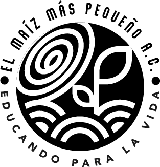

# PERFIL ACADÉMICO

**Julieta López**

***Licenciada en Ciencias de la Tierra***

## Áreas de interes  
1. Seguridad Hídrica
2. Gestión integral de cuencas
3. Ciencia Ciudadana
4. Fitoremediación.

## Experiencia
   
- Consultora ambiental en [ERM Environmental Resources Management](https://www.erm.com)
  - Ejecución de proyectos de remediación.
  - Ejecución de Evaluaciones Ambientales de Sitio Fase I y II.
  - Supervición de Seguridad Industrial.
  - Elaboración cartográfica en SIG (QGIS y ArcGIS).
- Consultoria en [El Maíz Más Pequeño A.C.](https://www.elmaizmaspequeno.org/)
   - Elaboración de cartografía.
- Consultora en [Taller de Innovación Urbana](https://innovacionurbana.teachable.com/)
  - Consultoria en cartografía y generación de datos cartograficos socioeconómicos y ambientales.
  - Intructora en talleres presenciales y virutales de cartografía con QGIS.
  - Consultoría en planeación territorial.
- Asistente de profesor en Facultad de Ciencias, [UNAM](https://www.unam.mx/).
  - Asignatura de Sistemas de Información Geográfica y Percepción Remota ( por 4 cursos durante 4 semestres).

<strong>Intento negrita en HTML</strong>  
<em>Intento itálica en HTML</em>

 
